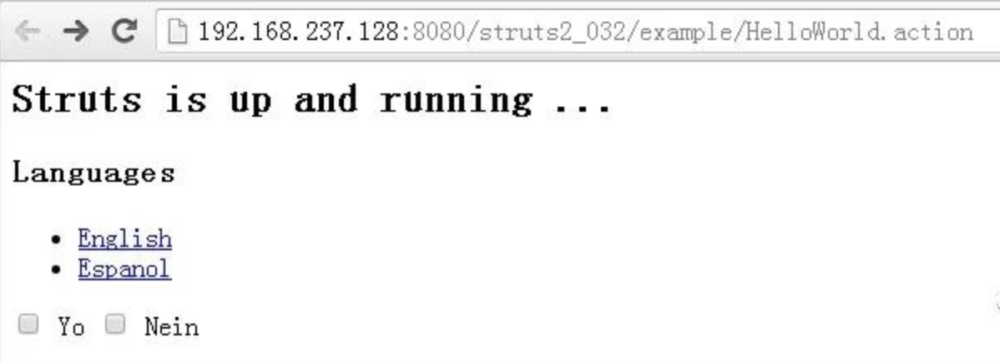
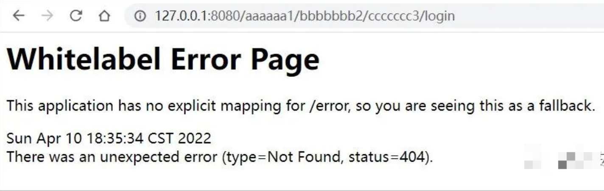
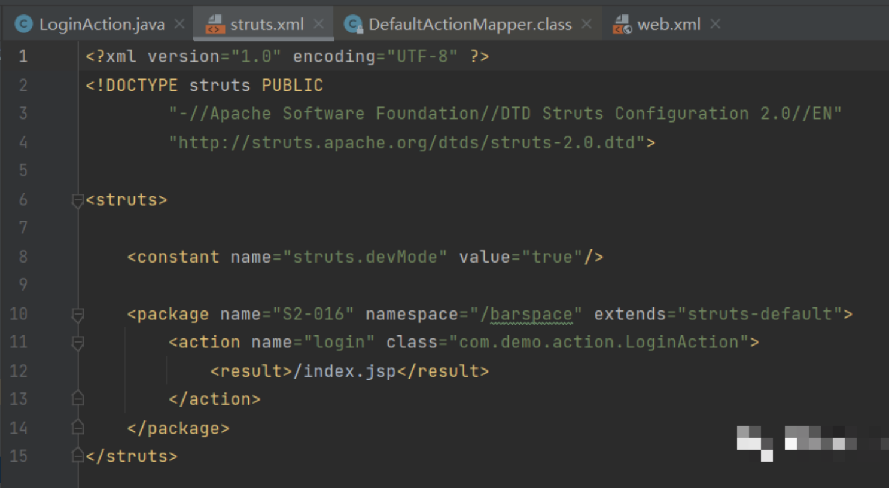
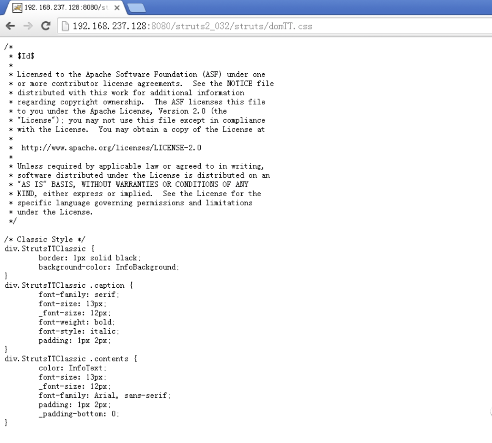
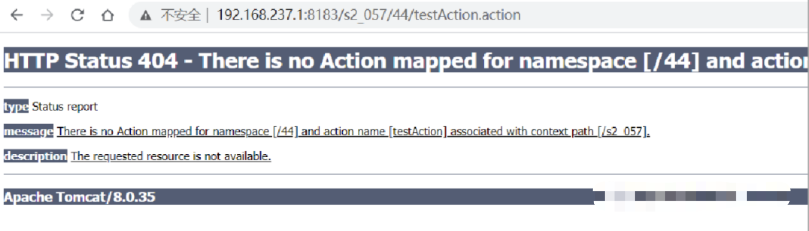
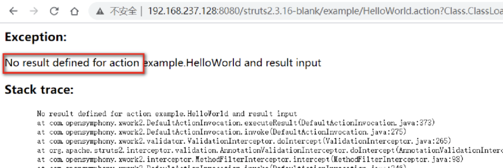
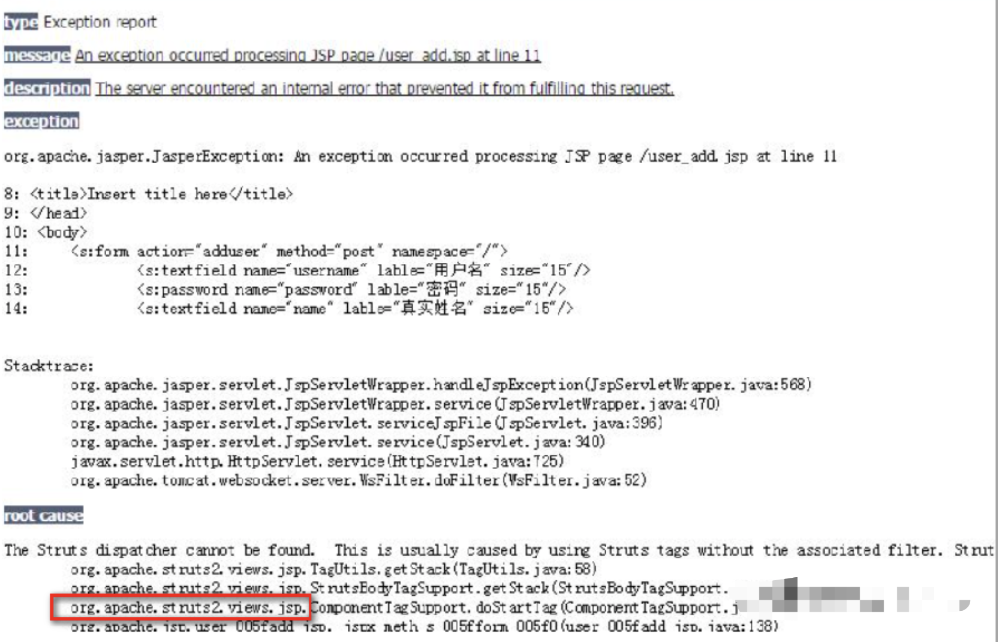

## 1. URL中添加不存在路径
在URL的反斜杠部分添加网站不存在的路径，最好是随机字符串组成的较长路径，如果返回同样的页面，则大概率是Struts2框架， 如果返回404或者是报错，则大概率是Spring框架。 
比如说：`http://127.0.0.1:9999/S2_016_war/barspace/xxxxxxxxx/login.do `
在Struts2框架下，完全可以正常返回页面。 
 
而Spring框架会出错  
 
如果两个URL均报错、或者均正常，无法区分，那么继续在前一个反斜杠处添加一个不存在的路径，以此类推，往前反复尝试。
`http://127.0.0.1:9999/S2_016_war/xxxxxxxxx/barspace/login.do `
`http://127.0.0.1:9999/xxxxxxxxx/S2_016_war/barspace/login.do`

### 原理
1. Struts2站点的URL路径包括四部分组成：工程名 + namespace命名空间 + action名 + Struts2扩展名  
例如：http://127.0.0.1:9999/S2_016_war/barspace/login.action
- /S2-016-war/ 部分是war包部署的工程名、项目名、上下文等等。
- /barspace/部分是Struts2的命名空间namespace。
- /login部分是Struts2的action名，指向具体处理请求的Java类。
- .action部分是Struts2的扩展名，也可以定义为.do、.dw等等。

如果网站应用直接部署在Tomcat根目录下，则工程名可以为空，此时URL为http://127.0.0.1:9999/barspace/login.action。
namespace命名空间 + action名 + Struts2扩展名均可以设置为空，也可以配置为有多个反斜杠的路径,例如namespace可以配置为/barspace/spac1，所以在URL的每一个反斜杠前都添加一次不存在URL路径的原因，因为很难直接从URL中判断出哪一部分是namespace、哪一部分是action名。
2. Struts2首先会在当前路径下找action名login，如果没有找到去上一层找，还没有找到会去上上层找，一直找到应用程序的根路径为止。
⚠️注：在网站的前端如果有nginx时，这种方法可能会无效，因为nginx可能会配置一些特殊URL转发，这时候就是nginx转发优先了。

## 2. URL添加/struts/domTT.css
在URL的Web应用根目录下添加/struts/domTT.css，如果返回css代码，那么99%是Struts2  
例如URL：http://192.168.237.128:8080/struts2_032/example/HelloWorld.action
在网站根目录下添加/struts/domTT.css后访问，返回css代码。
http://192.168.237.128:8080/struts2_032/struts/domTT.css

### 原理
凡是以/struts开头的URL，Struts2的过滤器都会到struts2-core-2.0.x.jar：/org/apache/struts2/static/下面去找资源，然后读取此文件内容。
⚠️注：  
这个domTT.css文件在网站源码文件中是找不到的，用磁盘搜索的方式搜索不到的，那为什么能访问到呢，因为这个文件在Struts2的jar包中。  
有一些低版本的Struts2框架，domTT.css文件不存在，需要更换为其它静态文件路径。

## 3. 404、500响应码返回信息不同
输入一个不存在的路径，返回404页面，或者传入一些乱码字符，造成当前页面500响应码报错，抛出异常信息。
Struts2报错常有的关键字：`no action mapped、struts2、namespace、defined for action`等。

Spring的报错信息如下：含有Whitelabel Error Page 关键字

## 4. 看网站图标favicon.ico
spring：小绿叶	struts2:通常没有favicon.ico图标
